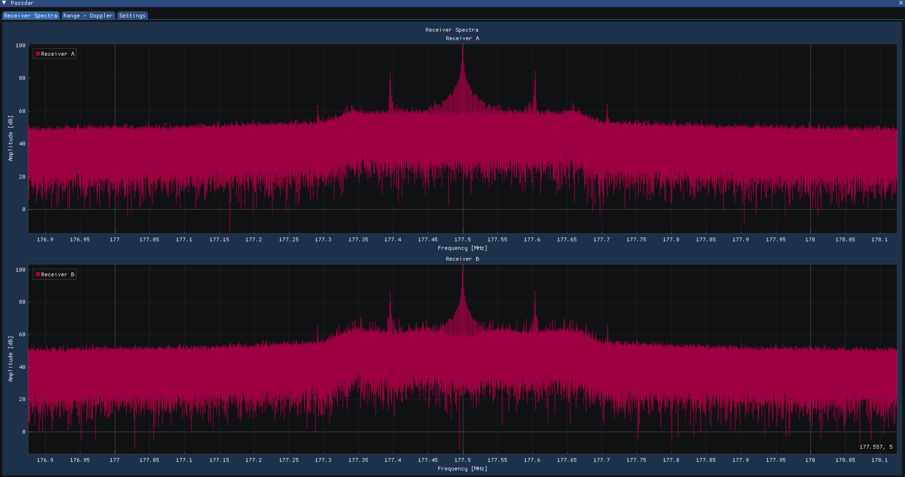
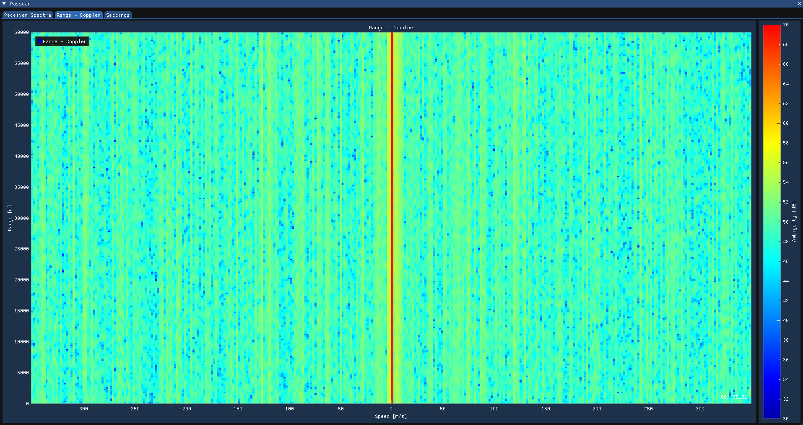

# Passdar

In the effort of learning radar processing and C++ I have attempted to create a
minimal function passive radar using an SDRplay RspDuo with two TV antennas.
The current implementation displays both live spectra from each receiver and
live ambiguity between the incoming signals.





## Build & Run

To clone and build the project while cloning external repositories recursively.

```bash
git clone --recurse-submodules https://github.com/mv-2/passdar.git
cd passdar
cmake -B build
cmake --build build
```

Run by pointing to config file.

```bash
./build/passdar cfg/cfg.json
```

On first startup, expect that the window will take a while to show. `FFTW`
is used to calculate the DFT and ambiguity which requires pre-computing
multiple FFTW plans using the `FFTW_PATIENT` option.
